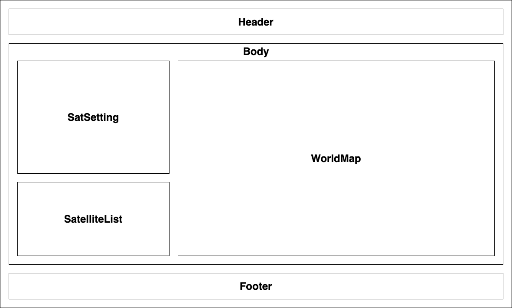
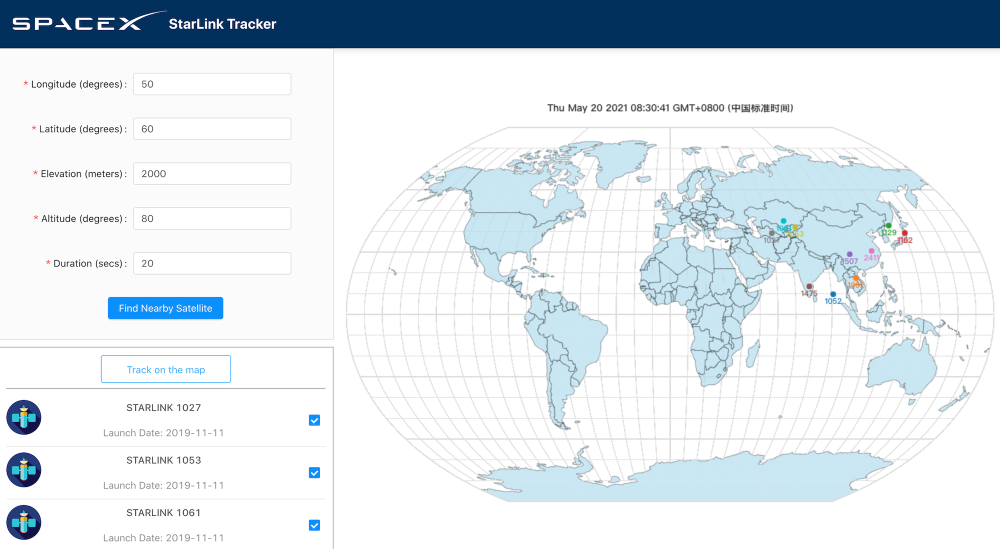

## Starlink

### Project Description

Ready for a space adventure? Starlink is a React.js project to track satellites in real-time based on geo-location. Users can enter parameters including longtitude and latitude to find all matched satellites, and then select one or a few satellites to view their animated trajectory on a world map for a custom duration. The real-time satellite tracking functionality is enabled by [N2YO.com](https://www.n2yo.com/).

### Technical Details

A lightweight frontend project based on **React.js**, Starlink uses **Ant Design** for user-friendly UI components and **D3** for dynamic satellite visualization. It also uses the **Axios** library to make AJAX requests and **create-react-app-buildpack** to deal with CORS issues. It is now deployed on **Heroku** and served via **Nginx** for better stability.

The app is bootstrapped using **create-react-app** boilerplate. The React component layout diagram is illustrated as below:

### How to Use

1. Visit the [Starlink website](https://starlink521.herokuapp.com/), enter all the parameter settings on the upper-left panel and click "Find Nearby Satellite". If you have no clue about the settings, feel free to use the example settings in the table below.

| Parameter  |  Unit  |    Range    | Example |
| :--------: | :----: | :---------: | :-----: |
| Longtitude | degree | -180 - 180  |   50    |
|  Latitude  | degree |  -90 - 90   |   60    |
| Elevation  | meter  | -413 - 8850 |  2000   |
|  Altitude  | degree |   0 - 90    |   80    |
|  Duration  | second |   0 - 90    |   20    |

2. Select the satellites you want to see on the bottom-left panel, click "Track on the map" and wait for the animation to load. Notice that "no data" will appear if there are no satellite on your specified geo-location, which means you need to go back and adjust your satellite settings.
3. View the selected satellite paths on the world map, and be awed!

Thanks for Lucie Wang's hardwork. Learned a lot!
